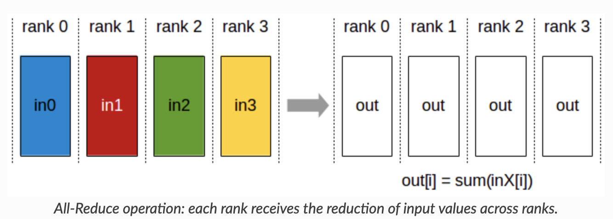
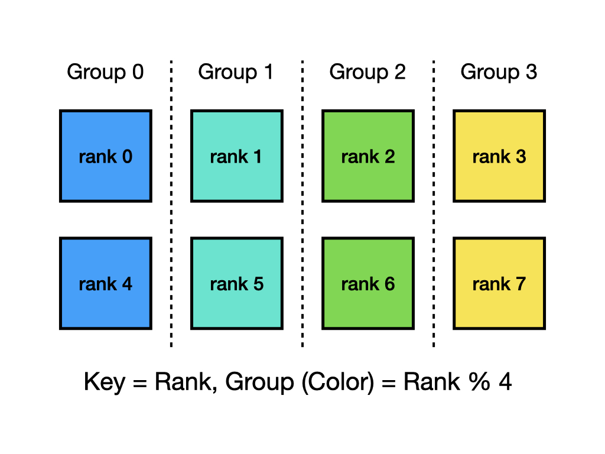

## Collective Communication Protocols for Data Parallel and Tensor Parallel training.

We develop communication protocols for Data Parallel and Tensor Model Parallel training from the ground up, utilizing the Message Passing Interface ([MPI](https://mpi4py.readthedocs.io/en/stable/)) and NumPy. The main focus will not be on the actual forward computation or backward propagation, instead the task will be to implement only the communication aspects.

**Note: we will only focus on the forward pass of the training loop for this.**

### Setup Guide

You'll need need a multi-core machine with at least 8 cores for this assignment.

#### Installing MPI
You'll need to have MPI installed for this assignment. 

##### Linux
```bash
sudo apt install libopenmpi-dev
```
##### MacOS
```bash
brew install openmpi
```
##### Windows
Go to the following and install mpiexec. Note, you'll have to use `mpiexec` instead of `mpirun` in all the commands in this assignment.
https://learn.microsoft.com/en-us/message-passing-interface/microsoft-mpi

#### Conda
The easiest way is to install an environment manager such as [Miniconda](https://docs.anaconda.com/free/miniconda/) and MPI for your OS (supported on MacOS, Linux, and Windows).

Once you have Conda installed and initialzied, create a new env with the following command:
```bash
conda create -n yourenv python=3.10 -y
```
Then activate it:
```bash
conda activate yourenv
```
Now you should be able to install the requirements.txt
```bash
pip install -r requirements.txt
```
Make sure your platform contains MPI support with at least 8 cores.

### 1.0. Warm-up

This document guides you step by step through a 2D parallel training pipeline,incorporating both tensor model and data parallel training. For tensor model parallel training, we will delve into the naive approach. 

To become acquainted with our communication protocols, we will begin by experimenting with the MPI package that has been installed.

#### MPI Test
To verify that *mpi4py* has been setup correctly for distributed workloads, run:
```bash
mpirun -n 8 python mpi-test.py
```

Or if you are using Windows, use `mpiexec` instead of `mpirun` for all of follow commands:
```bash
mpiexec -n 8 python mpi-test.py
```

Depending on your machine, you can control the number of processes lanched with the `-n` argument. 

Additionally, we have included some simple examples of MPI functions in mpi-test.py, such as Allreduce(), Allgather(), Reduce_scatter(), Split() and Alltoall(). Please note that these five MPI functions are the only ones you need to use and are permitted for this assignment.

- ##### All-Reduce

<p align="center">

</p>

You can see an all-reduce example by running:
```bash
mpirun -n 8 python mpi-test.py --test_case allreduce
```

- ##### All-Gather

<p align="center">

</p>

You can see an all-gather example by running:
```bash
mpirun -n 8 python mpi-test.py --test_case allgather
```

- ##### Reduce-Scatter

<p align="center">

</p>

You can see a reduce-scatter example by running:
```bash
mpirun -n 8 python mpi-test.py --test_case reduce_scatter
```

- ##### Split

<p align="center">

</p>


The Split function is particularly useful when applying MPI functions on a group basis. You can observe an example of group-wise reduction with the split function by running: 

```bash
mpirun -n 8 python mpi-test.py --test_case split
```

When playing with different test cases, try to get yourself familiar with the underline mpi functions 
and think about whether the output meets your expectation. 


#### Node Indexing Specifications

With a given data and model parallel size, we will assign nodes in a model parallel major for this assignment.
For instance, for `mp_size=2, dp_size=4` on 8 nodes we will group the nodes as shown below:

<p align="center">

</p>

### 1.1 Implementation of Collective Communication Primitives

In previous part, we directly use primitives from the MPI library. Now, we implement our own version of two primitives: all-reduce and all-to-all. See `mpi_wrapper/comm.py`

You can use 

```bash
mpirun -n 8 python mpi-test.py --test_case myallreduce
```

and 

```bash
mpirun -n 8 python mpi-test.py --test_case myalltoall
```

to check the correctness of your implementation. We can also see the time consumption of both implementation. 

Allreduce
Our implementation follows a reduce-then-broadcast approach, which has a communication complexity of O(2(p−1)) sends/receives, where p is the number of processes. MPI’s AllReduce often uses more sophisticated tree-based algorithms (e.g., recursive doubling, ring, Rabenseifner's algorithm), which optimize for bandwidth efficiency at larger scales but introduce latency overhead for small message sizes.

Alltoall
Using nonblocking send/receive in all-to-all collective communication improves performance by overlapping communication with computation and enabling message pipelining, reducing idle time and congestion. However, for large messages, its benefits diminish due to network congestion and memory pressure, potentially creating bottlenecks. 

### 1.2 Data Split for Data Parallel Training

The function takes in the training data and returns the data split according to the given `mp_size, dp_size` 
and `rank`. You should split data uniformly across data parallel groups while the model parallel groups can share the 
same data split within the same data parallel group. The data length is guaranteed to be divided equally by the
`dp_size` in all our test cases.

Hints: 
For `mp_size=2, dp_size=4`, you should split the data this way:
 
<p align="center">

</p>

To test your implementation, please run
```bash
python3 -m pytest -l -v tests/test_data_split.py
```

### 1.3 Layer Initialization

In this part, we get necessary information for model and data parallel training, which is then
used to initialize the corresponding layers in your model.

For this assignment we will work with a transformer layer.

You are only required to implement the communications within four fully connective layers within a transformer layer for forward and backward.
We have already taken care of the other stuffs i.e. the forward/backward computations and the training pipeline as these
are not relevant to the goal of this assignment.

For data parallel, we simply just split the batch of data equally across different data parallel groups.

For naive tensor model parallel training, we split the weight matrix of all of the fully connective layers (fc_q, fc_k, fc_v, fc_o)
along the output dimension (partition output) and shard them across different nodes. (Note that we don't shard different layers 
to different node as we don't consider pipeline parallelism here)

Given the above information, we need to implement the `get_info` function in `model/func_impl.py`.
The function gets essential information for later parts, including model/data parallel indexing,
model/data parallel communication groups, in/out dimensions for four FC layers. Please refers to the function for more information.

To test your implementation, please run
```bash
mpirun -n 8 python3 -m pytest -l -v --with-mpi tests/test_get_info.py
```

### 1.4 Naive Model Parallel Forward Communication

We implement the forward communications in W_o layer for the naive model parallel.
You need to implement the `naive_collect_forward_input` and `naive_collect_forward_output` functions in
`model/func_impl.py`. Please refer to the code for more details.

To test your implementations, please run
```bash
mpirun -n 4 python3 -m pytest -l -v --with-mpi tests/test_transformer_forward.py
```


### 1.5 Naive Model Parallel Backward Communication

We implement the backward communications in W_o layer for the naive model parallel.
You need to implement the `naive_collect_backward_input` and `naive_collect_backward_output` functions in
`model/func_impl.py`. Please refer to the code for more details.

To test your implementations, please run
```bash
mpirun -n 4 python3 -m pytest -l -v --with-mpi tests/test_transformer_backward.py
```

#### References 

- some images credited to https://docs.nvidia.com/deeplearning/nccl/user-guide/docs/usage/collectives.html
